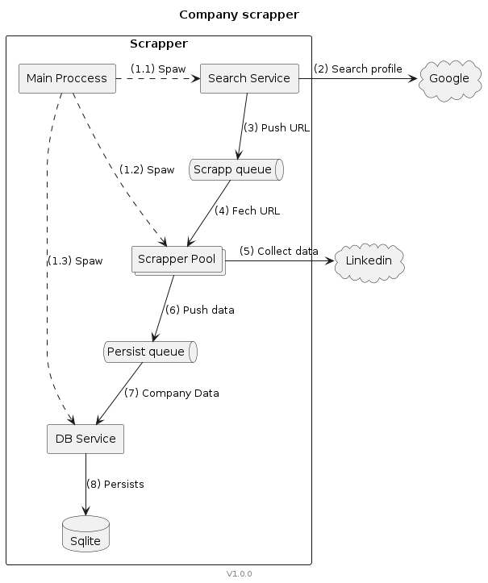

# Company profile scraper

__This is a proof of concept of a multiprocess scrapper. It serves only as an exercise of building such a system.__

The script gets a list of company names as an input and creates a database with the companies data. The input company list is a csv file where each row is a company name. 

At a high level the tool will: get the Linkedin url from google > scrap the Linkedin profile and collect data > store the scraped data into a sqlite database.

# Design

The design is split into 3 main services:
- Search Service
- Scrapper Service / Pool
- DB Service

Each service runs in its own process and is connected to input/output queues depending on the domain of the service. The systems are also connected to external applications. The external applications are linkedin and Google Search. 

To interact with the external application the services do use PlayWright to fetch data from the applications pages.



1. `Main Process` spawns all the 3 services
    1. `Search Service` is initialized with list of companies names and the `Scrapp queue` reference
    2. `Scrappers Pool` are initialized with references form `Scrapp queue` (input) and `Persist queue` (output)
    3. `DB Service` get the `Persist queue` as input and also a database name to store the data to
2. `Search service` query the linkedin url using `Google` search
3. `Search service` pushes all urls found at the `Scrapp queue`
4. `Scraper Service` pulls url from `Scrapp queue`
5. `Scraper Service` loads and scrap company data from `Linkedin` profile
6. `Scraper Service` pushes the scrapped company data into the `Persist queue`
7. `DB service` pulls data from `Persist queue`
8. `DB service` Stores data into `Sqlite` database

# Install
```shell
python3 -m venv venv
./venv/bin/python3 -m pip install -r requirements.txt
./venv/bin/playwright install
```

## Config files

Copy the sample config file `config.ini.sample` to `config.ini`.

```shell
cp config.ini.sample config.ini
```

Fill in the Linkedin username and password fields.

```ini
[scrappers]
workers = 1

[persistance]
database = companies.db

[linkedin]
username = <Linkedin username> 
password = <Linkedin password>

```

# Test
```shell
./venv/bin/python3 -m unittest
```

# Run

```shell
./venv/bin/python3 main.py tests/fixtures/companies_01.csv
```

# Roadmap

## Todos

### DB01 - Data model shared between scrapper service and database service

Sharing the same model for the two services creates a condition that any changes made on one service needs to be added to another service as well. This makes the design weak to change as any engineer maintaining the service needs to be aware of this sharing.

Ideally the database service must not know about the structure of the underlying data serving only as a proxy from the scraped data to the database.

Adding an a ORM such as SqlAlchemy to the project could improve this condition as it would abstract the management model-to-database removing this mappings from the database service

## Improvements

### Security checks

Linkedin will challenge the traffic coming from the scrapper based on the dynamics of the requests the scrapper does. This script does not implement a way to bypass the captchas

### Rate limiters

Both Linkedin and Google Search have rate limiters that can block any traffic from the scrapper. 

This script was intentionally designed as a multiprocessor system aiming to split the scrappers' processes and achieve some levels of distribution of the scrap process.
The scrappers services in scrapper pool can be put behind different IP addresses in order to avoid routing all the requests through the same address (proxying)

### ORM and Schema management

Adding an ORM such as SqlAlchemy and a database schema management such as Alembic would make data access and migrations easier going forward. Given the fact that this is not an extensive exercise (POC) those libraries were not added to the project.

### Domain data

Currently the scrapper only gets a small amount of data from Linkedin. There is much more information that can be pulled and added to the database. 

To name a few:
- List of employees
- Skills, age, location, languages, etc of employees
- Job opportunities
- Posts (Including some NLP processing)
- Mentions in Posts and Comments
- Employee transitions (What companies they came from, What companies they go to)

### Data Structure

TL;DR A graph database like Neo4j might represent the social connections better.

Linkedin is a social network and as such it is natural that its data is organized as connections between parties (Nodes and Edges). 

The database solution used for this exercise (Sqlite) is a relational SQL database. It is tailored to store structured data. 

So far, only company data is being stored in the database which makes Sqlite a good alternative. 
However this might not be the case when more entities like employees, events, jobs, post, etc are also added to the database. At this point migrating to a graph database such as Neo4J could have its advantages.

### Better test coverage
Yes, it needs more tests in order to be productionized (dev speed, CI/CD, ...)

### More services

The isolation of services makes it easy to add new scrappers and database solutions. The script could aggregate data from Linkedin and Crunchbase for example. It could store data both in Sqlite, Mongo and Neo4j.
